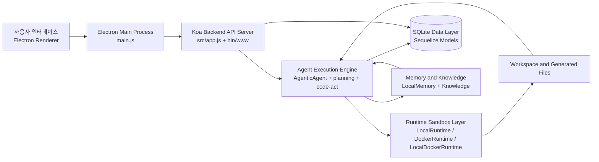
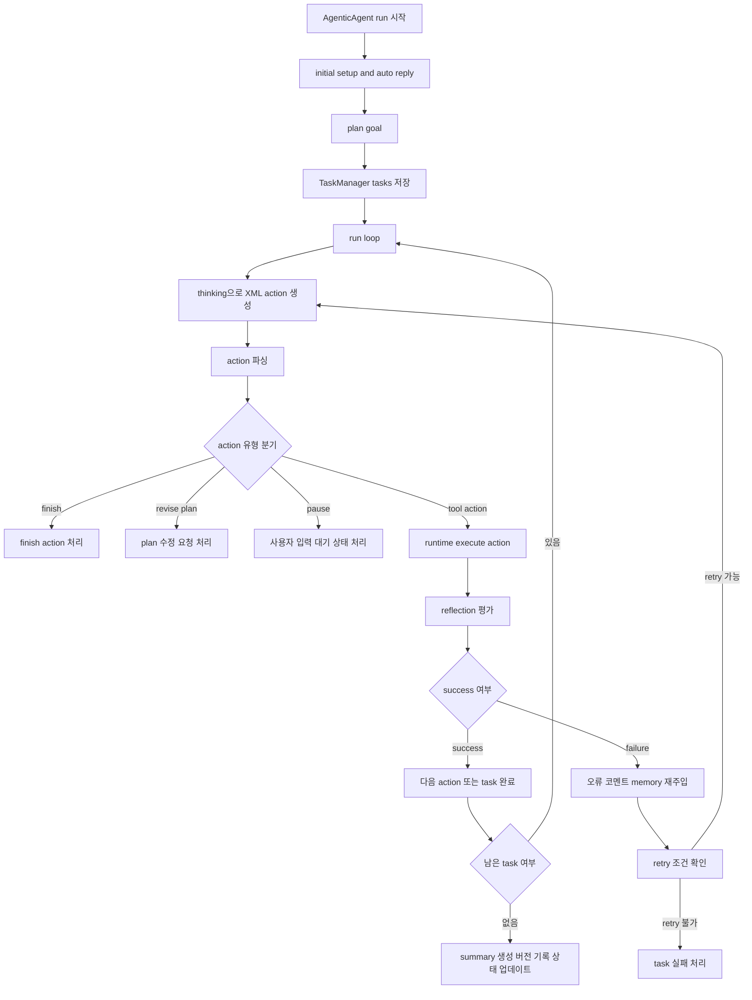
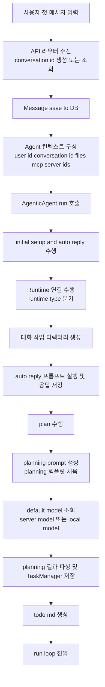
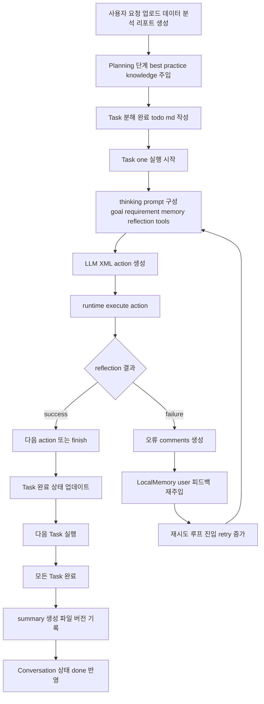
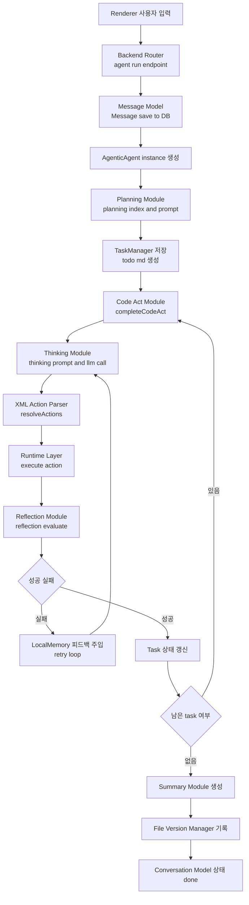

# LemonAI 작동 방식 기술보고서

## 1. 개요

LemonAI의 전체 구조는 Electron 메인 프로세스, Koa 기반 백엔드 API 서버, Agent 실행 엔진, Runtime 샌드박스 계층, SQLite 기반 데이터 계층의 결합 구조로 구성됨.
핵심 실행 흐름은 서비스 초기화 단계에서 데이터베이스 동기화 및 기본 데이터 주입 수행, 사용자 요청 수신 후 Agent 계획-실행-반성-요약 루프 수행, 결과 파일 버전 관리 및 대화 이력 저장으로 귀결되는 구조.

## 1.1 LemonAI 전체 시스템 아키텍처 다이어그램

LemonAI 전체 구성요소의 결합 구조를 한 눈에 파악하기 위한 아키텍처 다이어그램.

## 2. 서비스 시작 구조

### 2.1 실행 진입점

서비스 실행 진입점은 `bin/www` 파일이며, Koa 앱을 HTTP 서버로 감싼 뒤 기본 포트 `3000`으로 리스닝 수행 구조.
`npm start` 스크립트는 `node bin/www` 실행 방식으로 연결됨.

### 2.2 앱 부트스트랩

Koa 앱 초기화는 `src/app.js`에서 수행됨.
핵심 미들웨어 구성은 다음과 같음.

- `koa-body` 기반 multipart 요청 파싱 구성
- `koa-json` 기반 JSON 응답 가공 구성
- 정적 파일 서빙(`/public`) 구성
- 인증/토큰 관련 미들웨어(`setGlobalToken`, `auth`) 체인 구성
- 라우터 및 Swagger 문서 엔드포인트(`/swagger`) 연결 구성

### 2.3 Electron 환경의 시작 시퀀스

Electron 데스크톱 모드에서는 `main.js`의 `app.whenReady()` 이후 다음 순서로 초기화 진행 구조.

1. Docker 경로 탐지 및 PATH 주입 수행
2. `electron-store` 동적 import 수행
3. Docker Setup Service IPC 초기화 수행
4. DB 초기화 코드(`src/models/sync.js`) require 수행
5. 백엔드 서버(`bin/www`) require 기반 구동 수행
6. 메인 윈도우 생성 및 Docker setup check 수행

즉 Electron 모드에서 백엔드 서비스는 별도 프로세스 spawn이 아닌 same runtime require 부팅 구조로 결합됨.

## 3. DB 관련 사용 방법

### 3.1 DB 엔진 및 파일 위치

데이터 계층은 Sequelize ORM + SQLite dialect 조합 사용 구조.
실제 DB 파일은 `getFilepath('data', 'database.sqlite')` 경로 해석 결과 위치에 생성됨.

- Dialect: `sqlite`
- Storage: `database.sqlite`
- `timestamps: false`, `freezeTableName: true` 기본 모델 옵션 적용
- SQL 로깅 비활성(`logging: false`) 구성

### 3.2 스키마 생성 및 마이그레이션 성격

`src/models/sync.js`에서 다수 테이블에 대해 `Model.sync({ alter: true })` 호출 수행 구조.
이는 strict migration tool 없이 실행 시점에 스키마를 점진 반영하는 운영 방식.

대상 테이블 예시는 다음과 같음.

- Conversation, Message, Task
- Platform, Model, DefaultModelSetting
- SearchProvider, UserProviderConfig, UserSearchSetting
- File, FileVersion, Knowledge, Agent, McpServer, User, LLMLogs

### 3.3 초기 데이터 주입

`dataSync()` 단계에서 테이블 비어 있는 경우 기본 데이터 주입 수행 구조.

- 플랫폼/모델 기본값: `public/default_data/default_platform.json`
- 검색 제공자 기본값: `public/default_data/default_search_provider.json`
- 기본 사용자: `id: 1`, `user_salt: default123`

### 3.4 버전 업데이트형 보정 로직

`dataUpdate()` 단계에서 버전 간 보정성 업데이트 수행 구조.
예시는 다음과 같음.

- Volcengine API URL 보정
- Gemini/Cloudsway/Lemon 플랫폼 미존재 시 추가
- 일부 Search Provider 정리(Baidu/Bing 제거)

### 3.5 실사용 관점 DB 운용 지침

- 로컬/데스크톱 실행 시 앱 시작과 함께 자동 sync 수행 구조
- 컨테이너 실행 시에도 앱 시작 루틴에서 동일 sync 호출 구조
- 구조 변경 시 `sync({ alter: true })` 의존 방식 특성상 운영 데이터 백업 선행 권장 사항
- 기본 데이터 정의 변경 시 `public/default_data/*.json` 동시 관리 필요 사항

## 4. Self-Evolving 관련 핵심 알고리즘 상세 동작 원리

### 4.1 Self-Evolving의 코드상 의미

레포지토리 기준 Self-Evolving은 단일 학습 모델 재학습 개념이 아닌, 실행 중 생성되는 경험을 다음 의사결정에 재활용하는 메모리 기반 진화 구조.
구성 축은 다음과 같음.

- 계획 단계 지식 주입(`resolvePlanningKnowledge`)
- 실행 단계 지식 주입(`resolveThinkingKnowledge`)
- 태스크별 로컬 메모리(LocalMemory)
- 반성/오류 피드백 재주입(reflection -> memory user message)
- 대화 결과 요약/파일 버전화 누적

### 4.2 최상위 알고리즘 파이프라인

`AgenticAgent.run()` 기준 전체 파이프라인은 다음 순서.

1. `_initialSetupAndAutoReply()` 수행
2. `plan(goal)` 수행
3. `run_loop()` 반복 수행
4. `_generateFinalOutput()` 수행
5. Conversation 상태 `done/failed` 업데이트 수행

### 4.3 계획(Planning) 단계 상세

#### 4.3.1 입력

- 사용자 Goal
- 업로드 파일 목록
- 이전 대화 요약(`retrieveAndFormatPreviousSummary`)
- best-practice 지식(`resolvePlanningKnowledge`)

#### 4.3.2 프롬프트 구성

`src/agent/prompt/plan.js`에서 `src/template/planning.txt` 템플릿을 채우는 구조.
주요 슬롯은 다음과 같음.

- `{goal}`: 사용자 요구사항
- `{files}`: 업로드 파일 목록 설명
- `{previous}`: 이전 결과
- `{best_practice_knowledge}`: 지식 저장소 기반 지침
- `{system}`: 현재 시간 문자열

해당 planning 템플릿은 “전략가 역할”, “실행 도구명 직접 언급 금지”, “단계별 Markdown 계획 출력 강제” 제약 중심 설계.

#### 4.3.3 출력

- Markdown task list 생성
- `resolveMarkdown` 파싱 후 task 배열 변환
- `TaskManager.setTasks` 저장
- `todo.md` 파일 자동 생성 및 workspace 기록

### 4.4 실행(Code-Act) 단계 상세

#### 4.4.1 반복 루프 구조

`completeCodeAct()`는 태스크별 while 루프에서 다음 단계 반복 구조.

1. `thinking()`으로 다음 단일 XML action 생성
2. `resolveActions()`로 action 파싱
3. action 분기(`finish`, `revise_plan`, `pause_for_user_input`, 일반 tool action)
4. runtime action 실행(`context.runtime.execute_action`)
5. reflection 평가
6. 성공 시 다음 루프 지속 또는 finish, 실패 시 memory 피드백 누적 후 재시도

재시도 제약은 기본값 기준 `MAX_RETRY_TIMES = 3`, `MAX_TOTAL_RETRIES = 10` 구조.

#### 4.4.2 Thinking 프롬프트의 핵심 규칙

`src/template/thinking.txt`는 실행 에이전트의 핵심 정책 템플릿.
핵심 규칙은 다음과 같음.

- 출력은 반드시 “유효 XML” 단일 action
- Best Practices Memory 최우선 준수
- Tool-first 접근 우선
- 문서 생성 시 기본 Markdown 우선
- 파일 경로는 상대경로 강제
- 장기 실행/상호작용 프로세스 금지
- task 완료 시 `<finish><message>...</message></finish>` 반환

#### 4.4.3 Thinking 입력 컨텍스트

`resolveThinkingPrompt()`에서 주입되는 입력은 다음과 같음.

- 시스템 정보
- 앱 포트 정보
- 이전 대화 결과
- 로컬 실행 메모리
- 업로드 파일 설명
- 루트 goal + 현재 requirement
- reflection 피드백
- best_practices_knowledge
- 기본 도구 + MCP 도구 목록
- 동적 평가 옵션(core principle, current plan 등)

#### 4.4.4 Thinking 출력

- LLM 응답 문자열(XML expected)
- `<think>` 태그 포함 시 생각 부분 제거 후 action content만 추출
- 추출 결과를 LocalMemory에 assistant 메시지로 누적

### 4.5 Reflection 단계 상세

`src/agent/reflection/index.js` 기준 반성 로직은 경량 게이트 구조.

- action 실행 결과가 `failure` + error 포함 시 즉시 실패 반환
- action 실행 결과가 `success`면 즉시 성공 반환
- 중간 상태에서만 LLM 평가(`llmEvaluate`) 경유 가능 구조

현 코드 경로상 대부분의 정상 도구 실행은 status 기반 즉시 판정으로 귀결됨.
즉 reflection은 현재 버전에서 “복잡한 판정 엔진”보다 “오류 피드백 루프 보조 계층” 성격 강함.

### 4.6 메모리/지식 기반 진화 메커니즘

#### 4.6.1 태스크 로컬 메모리

각 task는 `conversation_id` + `task id` 기반 LocalMemory 인스턴스 분리 생성 구조.
실행 중 user/assistant 메시지와 오류 피드백 누적 저장 수행.

#### 4.6.2 지식 저장소 기반 프롬프트 강화

- Planning 시 카테고리: `user_profile`, `core_directive`, `planning`
- Thinking 시 카테고리: `user_profile`, `execution`, `core_directive`

즉 planning과 execution 단계가 서로 다른 지식 슬라이스를 주입받아 문맥 적응형 행동 수행 구조.

#### 4.6.3 실패 경험의 즉시 학습 효과

action 실패 또는 예외 발생 시 error/comments를 다음 turn의 user 피드백 메시지로 메모리에 주입 수행.
LLM은 직전 실패 맥락을 포함한 상태로 다음 action 재생성 수행.
이 루프가 Self-Evolving의 미시적 실행 학습 단위.

### 4.7 입력/출력 명세 요약

#### 4.7.1 주요 입력

- 사용자 자연어 목표(goal)
- 업로드 파일 메타데이터
- 과거 대화 요약
- 지식 저장소(best practice)
- 태스크 상태/현재 플랜/실행 메모리

#### 4.7.2 중간 출력

- Planning Markdown
- XML action command
- runtime tool execution result
- reflection status/comments
- todo.md 갱신본

#### 4.7.3 최종 출력

- summary 텍스트
- 생성 파일 메타데이터 집합
- 파일 버전 이력(`createFilesVersion`)
- conversation/message/task DB 상태 반영

### 4.8 Self-Evolving 핵심 알고리즘 동작 원리 흐름도

Self-Evolving 알고리즘의 핵심 제어 흐름을 단계적으로 표현한 다이어그램.

### 4.9 프롬프트별 목적 입력 출력 요약

#### 4.9.1 planning 프롬프트

- 주요 목적: 사용자 목표를 실행 가능한 task 목록으로 분해하는 계획 수립.
- 주요 입력: goal, 업로드 파일 목록, previous 결과, best practice knowledge, system 시간.
- 주요 출력: Markdown 형식 task 리스트, 후속 파서가 처리 가능한 구조화된 계획 텍스트.

#### 4.9.2 thinking 프롬프트

- 주요 목적: 현재 task를 한 단계 전진시키는 단일 XML action 생성.
- 주요 입력: goal, requirement, memory, reflection, tools, previous 결과, best practice knowledge, system 정보.
- 주요 출력: 단일 XML action 문자열, 필요 시 finish 또는 revise plan 또는 pause action.

#### 4.9.3 auto reply 프롬프트

- 주요 목적: 사용자 요청 접수 직후 초기 안내 및 자동 응답 생성.
- 주요 입력: 사용자 goal, conversation 문맥.
- 주요 출력: 초기 상태 안내 또는 실행 시작 메시지.

#### 4.9.4 summary 프롬프트

- 주요 목적: 전체 task 수행 결과와 산출 파일을 종합 정리한 최종 응답 생성.
- 주요 입력: goal, task 상태 목록, 생성 파일 메타데이터, static URL 문맥.
- 주요 출력: 사용자 전달용 최종 요약 텍스트.

## 5. 운영 관점 종합 정리

LemonAI의 서비스 운영 핵심은 “앱 시작 시 DB 동기화 + 기본값 보정”, “계획-실행-반성 루프”, “메모리/지식 재주입 기반 점진적 성능 개선” 3축 체계.
Self-Evolving은 모델 파라미터 업데이트가 아닌 프롬프트/메모리/지식/피드백 루프의 조합 최적화 방식으로 구현됨.
따라서 실제 품질 개선은 지식 카테고리 관리, 실패 피드백 품질, planning 템플릿 정밀도, tool 실행 신뢰성의 함수로 결정되는 구조적 특성.

## 6. 사용자 대화 시작 및 Evolving 흐름도

### 6.1 사용자의 첫 대화 시작 시 모델-프롬프트-코드 작동 흐름도

최초 대화 시작 시점의 실행 흐름은 요청 수신, 대화/메시지 저장, 기본 모델 결정, Agent 실행 경로 분기, Planning 및 Code-Act 진입의 연쇄 구조.
아래 흐름도는 사용자 첫 메시지 입력 직후부터 태스크 실행 루프 진입 직전까지의 엔드투엔드 단계 표현.

### 6.2 Evolving 수행 흐름도 사용자 대화 시나리오

시나리오 가정은 사용자가 "업로드한 데이터 파일을 분석하여 요약 리포트 생성" 요청을 시작하는 상황.
Evolving 핵심은 실행 중 실패/성공 피드백이 LocalMemory 및 Knowledge 주입 경로에 반영되고, 다음 액션 생성 품질이 순차 개선되는 폐루프 구조.

### 6.3 시나리오 기반 단계별 입출력 매핑

- 입력 단계: 사용자 자연어 요청, 업로드 파일 목록, 과거 대화 요약, agent knowledge 카테고리 데이터.
- 계획 단계 출력: Markdown 태스크 목록, task metadata, 초기 todo.md 파일.
- 실행 단계 입력: 현재 task requirement, LocalMemory 메시지 이력, reflection 피드백, 도구 정의.
- 실행 단계 출력: XML action, tool 결과, reflection status, 실패 시 교정 코멘트.
- 진화 단계 출력: 실패 원인의 메모리 누적, 다음 턴 프롬프트 품질 보정, 성공 확률 점진 향상.
- 종료 단계 출력: 최종 summary, 생성 파일 메타데이터, 버전 이력, DB 상태 업데이트.

### 6.4 시나리오 기준 프로그래밍 관점 아키텍처 실행 흐름도

동일 시나리오에서 실제 코드 계층과 컴포넌트 단위로 작동 위치를 표시한 흐름도.

## 7. 핵심 용어 간략 설명

- Electron Main Process: 데스크톱 앱 생명주기 관리, 윈도우 생성, 백엔드 부팅 연계를 담당하는 프로세스 계층.
- Electron Renderer: 사용자 인터페이스를 렌더링하고 사용자 입력을 수집하는 화면 계층.
- Koa Backend API Server: HTTP 요청 수신, 라우팅, 인증 미들웨어 적용, Agent 실행 트리거를 담당하는 API 계층.
- AgenticAgent: 목표 기반 task 계획, 실행, 반성, 요약을 오케스트레이션하는 상위 실행 제어 객체.
- Planning: 사용자 목표를 실행 가능한 task 목록으로 분해하는 단계.
- Code-Act Loop: LLM action 생성, action 실행, reflection 평가, 재시도 판단을 반복하는 실행 루프.
- Thinking Prompt: 현재 task 기준으로 다음 단일 XML action 생성을 유도하는 프롬프트 템플릿.
- Reflection: action 실행 결과를 성공 또는 실패로 판정하고 재시도 피드백을 생성하는 평가 단계.
- LocalMemory: task 단위 메시지 이력과 실패 피드백을 저장하여 다음 action 품질을 보정하는 메모리 계층.
- Knowledge: user profile, core directive, planning, execution 등 카테고리 지식을 프롬프트에 주입하는 지식 계층.
- Runtime Sandbox: 도구 실행을 격리하는 실행 환경 계층으로 local, docker, local-docker 모드 지원.
- TaskManager: task 상태 관리, pending task 선택, 진행 상태 갱신을 담당하는 관리 컴포넌트.
- Conversation: 대화 단위 상태와 메타데이터를 저장하는 데이터 모델.
- Message: 사용자/assistant 메시지를 저장하는 데이터 모델.
- SQLite Data Layer: 애플리케이션 영속 데이터를 저장하는 로컬 DB 계층.
- Sequelize: 모델 정의, 질의, 스키마 동기화를 수행하는 ORM 계층.
- sync alter: 실행 시점에 테이블 스키마를 점진적으로 반영하는 동기화 방식.
- todo md: planning 결과 task를 문서 형태로 기록하는 중간 산출 파일.
- createFilesVersion: 생성 파일 메타데이터를 파일 버전 이력으로 기록하는 버전 관리 유틸리티.
- best practice knowledge: planning/thinking 단계에서 최우선 지침으로 주입되는 운영 지식 집합.

## 8. 코드 기반 검증 관점 보완 사항

외부 참고 문서와 현재 코드베이스를 교차 확인한 결과, 현재 보고서에 이미 반영된 항목과 추가 보완 항목을 아래와 같이 정리.

### 8.1 이미 반영된 항목

- Planning 단계 지식 카테고리 주입 방식 반영 상태.
- Execution 단계 지식 카테고리 주입 방식 반영 상태.
- thinking 및 planning 프롬프트 기반 실행 구조 반영 상태.
- retry 루프와 task 상태 갱신 중심의 실행 제어 반영 상태.

### 8.2 추가 보완된 항목 요약

- 경험 저장의 실제 저장소 위치와 데이터 형태 보강.
- Reflection 동작에서 Prompt 설정 파일, 호출 함수, 모델 호출 경로 보강.
- Output 생성 시 경험이 어떤 경로로 재적용되는지 보강.
- evolve가 수행되는 레벨의 코드 관점 정의 보강.

### 8.3 경험 저장 형태와 저장소 위치

- 장기 경험 Knowledge 저장소는 SQLite DB의 Knowledge 테이블 기반 영속 저장 구조.
- 저장 단위는 rule 텍스트 중심이며 category 기반 필터링 후 Prompt Injection에 재사용되는 구조.
- 단기 실행 기억은 LocalMemory 기반 저장 구조로 task 단위 user/assistant 메시지 및 오류 피드백 누적 방식.
- 따라서 경험 저장은 DB 기반 장기 기억과 파일/메모리 기반 단기 기억의 이중 계층 구조.

### 8.4 Reflection 실제 동작 방식 코드 경로

Reflection은 두 레이어로 구분되는 구조.

1) Knowledge Evolution Reflection 레이어
- 코드 경로: `src/knowledge/feedback.js`.
- Prompt 템플릿: `src/template/knowledge.txt`.
- 입력: `user_request`, `user_feedback`, 현재 Knowledge 목록.
- 모델 호출: `chat_completion()` 경유 후 LLM 응답 JSON 수신.
- 반영 처리: `handleKnowledgeReflection()`으로 ADD/MODIFY/DELETE/NO_ACTION 연산 적용.
- 부가 상태: `Agent.experience_iteration_count` 증가 반영.

2) Task Execution Reflection 레이어
- 코드 경로: `src/agent/reflection/index.js`.
- 기본 동작: tool 실행 결과의 status 기반 즉시 성공/실패 판정 우선.
- 조건부 동작: 중간 판정 필요 시 `llmEvaluate` 경유 평가 수행 가능 구조.

### 8.5 모델 호출 방식 정리

- Planning 호출 경로: `src/agent/planning/index.js`에서 `getDefaultModel` 기반 server/local 분기 후 LLM 호출.
- Thinking 호출 경로: `src/agent/code-act/thinking.js`에서 동일하게 `getDefaultModel` 기반 server/local 분기 후 LLM 호출.
- Knowledge Reflection 호출 경로: `src/knowledge/feedback.js`에서 `chat_completion` 기반 호출 수행.
- 로그 저장: LLM 호출 기록은 `LLMLogs` 모델로 적재되는 구조.

### 8.6 Output 생성 시 경험 적용 방식

- 직접 적용 경로는 Prompt Injection 구조.
- Planning 시 `resolvePlanningKnowledge`가 category 필터링된 Knowledge를 문자열 결합 후 planning Prompt에 삽입.
- Execution 시 `resolveThinkingKnowledge`가 category 필터링된 Knowledge를 thinking Prompt에 삽입.
- 실패 피드백은 LocalMemory user 메시지로 재주입되어 다음 action 생성에 즉시 반영.
- 최종 summary는 task 결과와 생성 파일 메타데이터를 종합하되, 간접적으로는 앞선 knowledge 주입과 memory 누적의 영향이 반영된 결과.

### 8.7 Evolve 수행 레벨 정의

- evolve는 단순 Output 문구 교정 레벨이 아닌 전략/규칙/사용자 프로필 레벨 수행 구조.
- 장기 evolve: Knowledge DB 갱신을 통한 planning/execution 정책 변화.
- 단기 evolve: LocalMemory 오류 피드백 누적을 통한 현재 task 실행 품질 보정.
- 결론적으로 LemonAI의 evolve는 Prompt-Policy 레벨과 Execution-Control 레벨의 결합 진화 구조.
