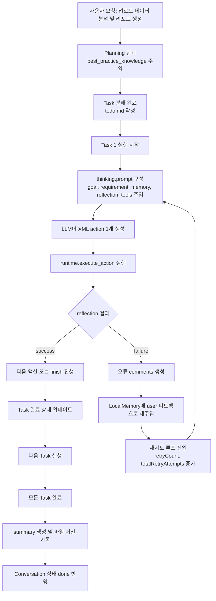

# LemonAI 작동 방식 기술보고서

## 1. 개요

LemonAI의 전체 구조는 Electron 메인 프로세스, Koa 기반 백엔드 API 서버, Agent 실행 엔진, Runtime 샌드박스 계층, SQLite 기반 데이터 계층의 결합 구조로 구성됨.
핵심 실행 흐름은 서비스 초기화 단계에서 데이터베이스 동기화 및 기본 데이터 주입 수행, 사용자 요청 수신 후 Agent 계획-실행-반성-요약 루프 수행, 결과 파일 버전 관리 및 대화 이력 저장으로 귀결되는 구조.

## 2. 서비스 시작 구조

### 2.1 실행 진입점

서비스 실행 진입점은 `bin/www` 파일이며, Koa 앱을 HTTP 서버로 감싼 뒤 기본 포트 `3000`으로 리스닝 수행 구조.
`npm start` 스크립트는 `node bin/www` 실행 방식으로 연결됨.

### 2.2 앱 부트스트랩

Koa 앱 초기화는 `src/app.js`에서 수행됨.
핵심 미들웨어 구성은 다음과 같음.

- `koa-body` 기반 multipart 요청 파싱 구성
- `koa-json` 기반 JSON 응답 가공 구성
- 정적 파일 서빙(`/public`) 구성
- 인증/토큰 관련 미들웨어(`setGlobalToken`, `auth`) 체인 구성
- 라우터 및 Swagger 문서 엔드포인트(`/swagger`) 연결 구성

### 2.3 Electron 환경의 시작 시퀀스

Electron 데스크톱 모드에서는 `main.js`의 `app.whenReady()` 이후 다음 순서로 초기화 진행 구조.

1. Docker 경로 탐지 및 PATH 주입 수행
2. `electron-store` 동적 import 수행
3. Docker Setup Service IPC 초기화 수행
4. DB 초기화 코드(`src/models/sync.js`) require 수행
5. 백엔드 서버(`bin/www`) require 기반 구동 수행
6. 메인 윈도우 생성 및 Docker setup check 수행

즉 Electron 모드에서 백엔드 서비스는 별도 프로세스 spawn이 아닌 same runtime require 부팅 구조로 결합됨.

## 3. DB 관련 사용 방법

### 3.1 DB 엔진 및 파일 위치

데이터 계층은 Sequelize ORM + SQLite dialect 조합 사용 구조.
실제 DB 파일은 `getFilepath('data', 'database.sqlite')` 경로 해석 결과 위치에 생성됨.

- Dialect: `sqlite`
- Storage: `database.sqlite`
- `timestamps: false`, `freezeTableName: true` 기본 모델 옵션 적용
- SQL 로깅 비활성(`logging: false`) 구성

### 3.2 스키마 생성 및 마이그레이션 성격

`src/models/sync.js`에서 다수 테이블에 대해 `Model.sync({ alter: true })` 호출 수행 구조.
이는 strict migration tool 없이 실행 시점에 스키마를 점진 반영하는 운영 방식.

대상 테이블 예시는 다음과 같음.

- Conversation, Message, Task
- Platform, Model, DefaultModelSetting
- SearchProvider, UserProviderConfig, UserSearchSetting
- File, FileVersion, Knowledge, Agent, McpServer, User, LLMLogs

### 3.3 초기 데이터 주입

`dataSync()` 단계에서 테이블 비어 있는 경우 기본 데이터 주입 수행 구조.

- 플랫폼/모델 기본값: `public/default_data/default_platform.json`
- 검색 제공자 기본값: `public/default_data/default_search_provider.json`
- 기본 사용자: `id: 1`, `user_salt: default123`

### 3.4 버전 업데이트형 보정 로직

`dataUpdate()` 단계에서 버전 간 보정성 업데이트 수행 구조.
예시는 다음과 같음.

- Volcengine API URL 보정
- Gemini/Cloudsway/Lemon 플랫폼 미존재 시 추가
- 일부 Search Provider 정리(Baidu/Bing 제거)

### 3.5 실사용 관점 DB 운용 지침

- 로컬/데스크톱 실행 시 앱 시작과 함께 자동 sync 수행 구조
- 컨테이너 실행 시에도 앱 시작 루틴에서 동일 sync 호출 구조
- 구조 변경 시 `sync({ alter: true })` 의존 방식 특성상 운영 데이터 백업 선행 권장 사항
- 기본 데이터 정의 변경 시 `public/default_data/*.json` 동시 관리 필요 사항

## 4. Self-Evolving 관련 핵심 알고리즘 상세 동작 원리

### 4.1 Self-Evolving의 코드상 의미

레포지토리 기준 Self-Evolving은 단일 학습 모델 재학습 개념이 아닌, 실행 중 생성되는 경험을 다음 의사결정에 재활용하는 메모리 기반 진화 구조.
구성 축은 다음과 같음.

- 계획 단계 지식 주입(`resolvePlanningKnowledge`)
- 실행 단계 지식 주입(`resolveThinkingKnowledge`)
- 태스크별 로컬 메모리(LocalMemory)
- 반성/오류 피드백 재주입(reflection -> memory user message)
- 대화 결과 요약/파일 버전화 누적

### 4.2 최상위 알고리즘 파이프라인

`AgenticAgent.run()` 기준 전체 파이프라인은 다음 순서.

1. `_initialSetupAndAutoReply()` 수행
2. `plan(goal)` 수행
3. `run_loop()` 반복 수행
4. `_generateFinalOutput()` 수행
5. Conversation 상태 `done/failed` 업데이트 수행

### 4.3 계획(Planning) 단계 상세

#### 4.3.1 입력

- 사용자 Goal
- 업로드 파일 목록
- 이전 대화 요약(`retrieveAndFormatPreviousSummary`)
- best-practice 지식(`resolvePlanningKnowledge`)

#### 4.3.2 프롬프트 구성

`src/agent/prompt/plan.js`에서 `src/template/planning.txt` 템플릿을 채우는 구조.
주요 슬롯은 다음과 같음.

- `{goal}`: 사용자 요구사항
- `{files}`: 업로드 파일 목록 설명
- `{previous}`: 이전 결과
- `{best_practice_knowledge}`: 지식 저장소 기반 지침
- `{system}`: 현재 시간 문자열

해당 planning 템플릿은 “전략가 역할”, “실행 도구명 직접 언급 금지”, “단계별 Markdown 계획 출력 강제” 제약 중심 설계.

#### 4.3.3 출력

- Markdown task list 생성
- `resolveMarkdown` 파싱 후 task 배열 변환
- `TaskManager.setTasks` 저장
- `todo.md` 파일 자동 생성 및 workspace 기록

### 4.4 실행(Code-Act) 단계 상세

#### 4.4.1 반복 루프 구조

`completeCodeAct()`는 태스크별 while 루프에서 다음 단계 반복 구조.

1. `thinking()`으로 다음 단일 XML action 생성
2. `resolveActions()`로 action 파싱
3. action 분기(`finish`, `revise_plan`, `pause_for_user_input`, 일반 tool action)
4. runtime action 실행(`context.runtime.execute_action`)
5. reflection 평가
6. 성공 시 다음 루프 지속 또는 finish, 실패 시 memory 피드백 누적 후 재시도

재시도 제약은 기본값 기준 `MAX_RETRY_TIMES = 3`, `MAX_TOTAL_RETRIES = 10` 구조.

#### 4.4.2 Thinking 프롬프트의 핵심 규칙

`src/template/thinking.txt`는 실행 에이전트의 핵심 정책 템플릿.
핵심 규칙은 다음과 같음.

- 출력은 반드시 “유효 XML” 단일 action
- Best Practices Memory 최우선 준수
- Tool-first 접근 우선
- 문서 생성 시 기본 Markdown 우선
- 파일 경로는 상대경로 강제
- 장기 실행/상호작용 프로세스 금지
- task 완료 시 `<finish><message>...</message></finish>` 반환

#### 4.4.3 Thinking 입력 컨텍스트

`resolveThinkingPrompt()`에서 주입되는 입력은 다음과 같음.

- 시스템 정보
- 앱 포트 정보
- 이전 대화 결과
- 로컬 실행 메모리
- 업로드 파일 설명
- 루트 goal + 현재 requirement
- reflection 피드백
- best_practices_knowledge
- 기본 도구 + MCP 도구 목록
- 동적 평가 옵션(core principle, current plan 등)

#### 4.4.4 Thinking 출력

- LLM 응답 문자열(XML expected)
- `<think>` 태그 포함 시 생각 부분 제거 후 action content만 추출
- 추출 결과를 LocalMemory에 assistant 메시지로 누적

### 4.5 Reflection 단계 상세

`src/agent/reflection/index.js` 기준 반성 로직은 경량 게이트 구조.

- action 실행 결과가 `failure` + error 포함 시 즉시 실패 반환
- action 실행 결과가 `success`면 즉시 성공 반환
- 중간 상태에서만 LLM 평가(`llmEvaluate`) 경유 가능 구조

현 코드 경로상 대부분의 정상 도구 실행은 status 기반 즉시 판정으로 귀결됨.
즉 reflection은 현재 버전에서 “복잡한 판정 엔진”보다 “오류 피드백 루프 보조 계층” 성격 강함.

### 4.6 메모리/지식 기반 진화 메커니즘

#### 4.6.1 태스크 로컬 메모리

각 task는 `conversation_id` + `task id` 기반 LocalMemory 인스턴스 분리 생성 구조.
실행 중 user/assistant 메시지와 오류 피드백 누적 저장 수행.

#### 4.6.2 지식 저장소 기반 프롬프트 강화

- Planning 시 카테고리: `user_profile`, `core_directive`, `planning`
- Thinking 시 카테고리: `user_profile`, `execution`, `core_directive`

즉 planning과 execution 단계가 서로 다른 지식 슬라이스를 주입받아 문맥 적응형 행동 수행 구조.

#### 4.6.3 실패 경험의 즉시 학습 효과

action 실패 또는 예외 발생 시 error/comments를 다음 turn의 user 피드백 메시지로 메모리에 주입 수행.
LLM은 직전 실패 맥락을 포함한 상태로 다음 action 재생성 수행.
이 루프가 Self-Evolving의 미시적 실행 학습 단위.

### 4.7 입력/출력 명세 요약

#### 4.7.1 주요 입력

- 사용자 자연어 목표(goal)
- 업로드 파일 메타데이터
- 과거 대화 요약
- 지식 저장소(best practice)
- 태스크 상태/현재 플랜/실행 메모리

#### 4.7.2 중간 출력

- Planning Markdown
- XML action command
- runtime tool execution result
- reflection status/comments
- todo.md 갱신본

#### 4.7.3 최종 출력

- summary 텍스트
- 생성 파일 메타데이터 집합
- 파일 버전 이력(`createFilesVersion`)
- conversation/message/task DB 상태 반영

## 5. 운영 관점 종합 정리

LemonAI의 서비스 운영 핵심은 “앱 시작 시 DB 동기화 + 기본값 보정”, “계획-실행-반성 루프”, “메모리/지식 재주입 기반 점진적 성능 개선” 3축 체계.
Self-Evolving은 모델 파라미터 업데이트가 아닌 프롬프트/메모리/지식/피드백 루프의 조합 최적화 방식으로 구현됨.
따라서 실제 품질 개선은 지식 카테고리 관리, 실패 피드백 품질, planning 템플릿 정밀도, tool 실행 신뢰성의 함수로 결정되는 구조적 특성.

## 6. 사용자 대화 시작 및 Evolving 흐름도

### 6.1 사용자의 첫 대화 시작 시 모델-프롬프트-코드 작동 흐름도

최초 대화 시작 시점의 실행 흐름은 요청 수신, 대화/메시지 저장, 기본 모델 결정, Agent 실행 경로 분기, Planning 및 Code-Act 진입의 연쇄 구조.
아래 흐름도는 사용자 첫 메시지 입력 직후부터 태스크 실행 루프 진입 직전까지의 엔드투엔드 단계 표현.

```mermaid
flowchart TD
    A[사용자 첫 메시지 입력] --> B[API 라우터 수신<br/>conversation_id 생성 또는 조회]
    B --> C[Message.saveToDB로 사용자 메시지 저장]
    C --> D[Agent 컨텍스트 구성<br/>user_id, conversation_id, files, mcp_server_ids]
    D --> E[AgenticAgent.run 호출]
    E --> F[_initialSetupAndAutoReply 수행]
    F --> G[Runtime 연결 수행<br/>RUNTIME_TYPE local/docker/local-docker 분기]
    G --> H[대화 작업 디렉터리 생성]
    H --> I[auto_reply 프롬프트 실행 및 응답 저장]
    I --> J[plan(goal) 수행]
    J --> K[resolvePlanningPrompt 호출<br/>planning.txt 템플릿 채움]
    K --> L[getDefaultModel로 모델 경로 결정<br/>subscribe 서버모델 또는 로컬모델]
    L --> M[planning 결과 파싱 및 TaskManager 저장]
    M --> N[todo.md 생성]
    N --> O[run_loop 진입]
```

### 6.2 Evolving 수행 흐름도 사용자 대화 시나리오

시나리오 가정은 사용자가 "업로드한 데이터 파일을 분석하여 요약 리포트 생성" 요청을 시작하는 상황.
Evolving 핵심은 실행 중 실패/성공 피드백이 LocalMemory 및 Knowledge 주입 경로에 반영되고, 다음 액션 생성 품질이 순차 개선되는 폐루프 구조.



### 6.3 시나리오 기반 단계별 입출력 매핑

- 입력 단계: 사용자 자연어 요청, 업로드 파일 목록, 과거 대화 요약, agent knowledge 카테고리 데이터.
- 계획 단계 출력: Markdown 태스크 목록, task metadata, 초기 todo.md 파일.
- 실행 단계 입력: 현재 task requirement, LocalMemory 메시지 이력, reflection 피드백, 도구 정의.
- 실행 단계 출력: XML action, tool 결과, reflection status, 실패 시 교정 코멘트.
- 진화 단계 출력: 실패 원인의 메모리 누적, 다음 턴 프롬프트 품질 보정, 성공 확률 점진 향상.
- 종료 단계 출력: 최종 summary, 생성 파일 메타데이터, 버전 이력, DB 상태 업데이트.
